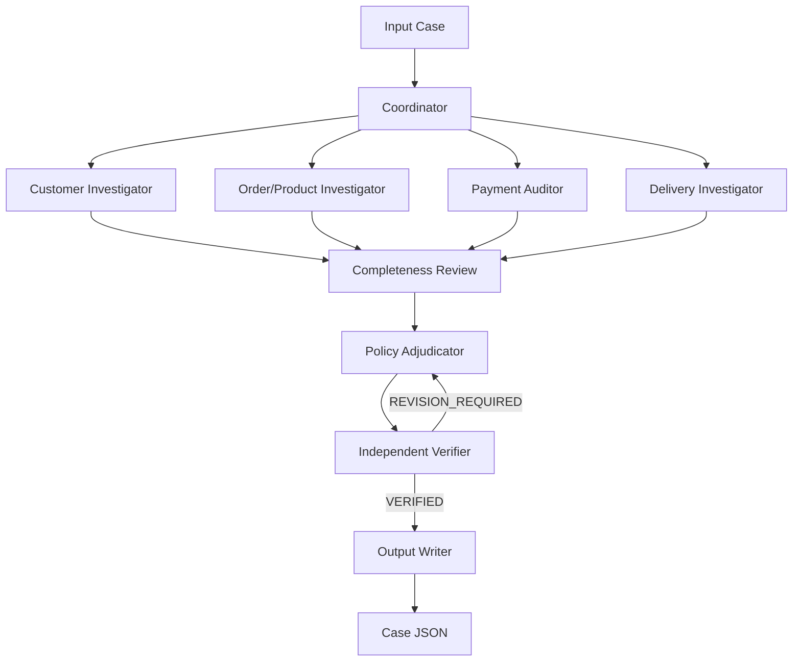

# Multi-Agent E-Commerce Dispute Resolution

## Objective

The system investigates each Olist support case through restricted specialist agents, submits a structured evidence dossier to a Policy Adjudicator, and independently verifies the resulting output before writing JSON.

## Boundaries and permissions

| Agent | Authorized tools | Prohibited decisions |
|---|---|---|
| Coordinator | none | raw data access, calculations, policy outcomes |
| Customer Investigator | customer identity/history tools | payments, delivery, product, policy |
| Order/Product Investigator | order, item, product, seller tools | responsibility, refund, primary issue |
| Payment Auditor | payment/item and money tools | refund decision, responsibility |
| Delivery Investigator | delivery/item and time tools | blame, root cause, refund |
| Policy Adjudicator | no raw-data tools | inventing facts/evidence |
| Verifier | evidence lookup, arithmetic, schema/limit checks | silently repairing the decision |

The `ToolRegistry` exposes every tool centrally, but `AgentRuntime.run_json` receives an explicit allow-list for each call. Unauthorized model tool calls are rejected. Tools return narrow JSON records, never complete dataframes.

## Agent-to-agent handoff

All assignments and reports use `AgentMessage` with `message_id`, `case_id`, sender, recipient, message type, objective, payload, evidence IDs, parent message ID, and timestamp. Every handoff is written to `logging/trace.jsonl`.

Specialists execute concurrently in a bounded `ThreadPoolExecutor`. The Coordinator waits for all four reports, records a dossier, and sends it to the Policy Adjudicator. The adjudicator sees the policy text and specialist reports—not the datastore. The Verifier sees the candidate and dossier, then returns `VERIFIED` or `REVISION_REQUIRED`. Revision is bounded by `--max-revisions` (default two); exhausted cases fail rather than receiving a plausible fabricated output.

## Policy reasoning

`src/policies/EC_POLICY_V2.md` is authoritative context for the Policy Adjudicator. Python does not select the primary issue. It only loads data, performs safe arithmetic/time calculations, validates evidence, validates schemas, and serializes output. The adjudicator must check canceled-paid and unavailable-paid before delivery and payment alternatives, and it must provide justification paths into specialist reports.

## Data and evidence

`DataStore` loads each CSV once and creates stable-order indices for orders, customers, items, payments, products, sellers, and categories. Evidence IDs are parsed and checked against actual source records: `order`, `item`, `payment`, `seller`, or known policy root-cause IDs. Unsupported IDs are verifier defects.

Money uses `Decimal` rounded to two places. Timestamps remain in the CSV format and are compared without timezone conversion. Missing item-row reconciliation values are `null`.

## Trace and failure handling

`TraceWriter` truncates the trace at the beginning of every full run. Events include case start/failure/completion, task creation/handoffs, model requests/responses, tool calls, reports, policy decisions, revisions, verification, and output writes. Secrets and authorization headers are never written.

Provider errors, invalid JSON, invalid Pydantic outputs, missing records, invalid timestamps, and tool failures are bounded and recorded. A failed case does not block later cases. `run.py --case-id EC_001` supports isolated debugging.

## Model and reproducibility

The provider is the OpenAI Python SDK using `gpt-4o-mini`, declared in `provider.py` and `logging/metadata.json`; credentials come from `.env` as `OPENAI_API_KEY`. The implementation uses an explicit Python state graph rather than pretending that a single prompt is multiple agents. See `requirements.txt` for dependencies and `run.py` for the CLI.
