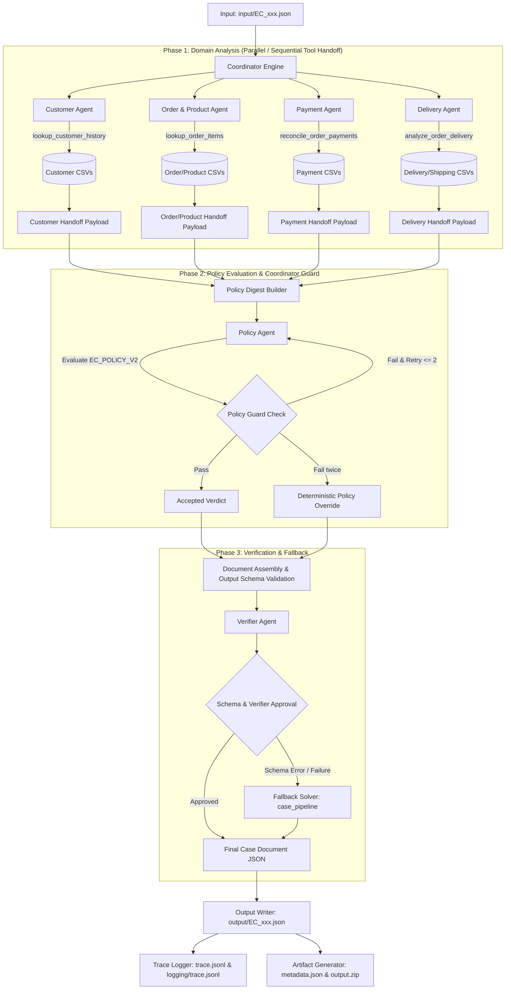

# Kiến trúc Multi-Agent (A2A) — E-Commerce Dispute Resolution System

Hệ thống xử lý khiếu nại thương mại điện tử Multi-Agent được thiết kế theo kiến trúc **Agent-to-Agent (A2A)** với cơ chế quản lý phi tập trung theo miền dữ liệu (Domain-driven), phân quyền truy cập công cụ nghiêm ngặt (Strict Tool Access Control) và có sự giám sát đảm bảo chất lượng (Deterministic Policy Guard & Fallback Engine) bởi **Coordinator Agent**.

---

## 1. Sơ đồ Tổng quan Kiến trúc & Luồng Thực thi (Pipeline Flow)

### Sơ đồ Luồng Công việc (Mermaid Diagram)



### Sơ đồ Trình tự Handoff (ASCII Sequence Diagram)

```
Input Request  Coordinator     Domain Agents          Policy Agent     Policy Guard    Verifier Agent    Output System
     |              |                |                     |                 |                |                |
     |---run_case-->|                |                     |                 |                |                |
     |              |--dispatch----->| (Customer/Order/    |                 |                |                |
     |              |                |  Payment/Delivery)  |                 |                |                |
     |              |<--tool_call----|                     |                 |                |                |
     |              |<--handoff------|                     |                 |                |                |
     |              |                                      |                 |                |                |
     |              |--build_digest----------------------->|                 |                |                |
     |              |                                      |--verdict------->|                |                |
     |              |                                      |                 |--validate----->|                |
     |              |                                      |                 | (Pass/Override)|                |
     |              |                                      |<----------------|                |                |
     |              |--assemble_doc---------------------------------------------------------->|                |
     |              |                                                                         |--review------->|
     |              |                                                                         |<--approved-----|
     |              |--write_output--------------------------------------------------------------------------->| (output/*.json)
     |              |--emit_trace---------------------------------------------------------------------------->| (trace.jsonl)
     |              |--package_zip--------------------------------------------------------------------------->| (output.zip)
```

---

## 2. Vai trò, Công cụ và Quyền truy cập Dữ liệu của các Agent

Hệ thống tuân thủ nguyên tắc **Phân chia Trách nhiệm (Separation of Duties)**. Mỗi Agent chỉ có quyền gọi duy nhất công cụ được cấp phép tại `src/tools_engine.py`, không được phép tự tính toán arithmetic hoặc truy cập trái phép dữ liệu thuộc domain của Agent khác.

| Agent Name | Vai trò & Trách nhiệm chính | Tool được cấp phép (`ToolRegistry`) | Dữ liệu CSV truy cập | Key Output & Handoff Payload |
| :--- | :--- | :--- | :--- | :--- |
| **Coordinator Agent** | Tiếp nhận khiếu nại, điều phối toàn bộ luồng A2A, tổng hợp dữ liệu, kiểm soát quy tắc Policy, quản lý Retry/Override và kiểm tra Schema. | *None (Orchestrator)* | *Không truy cập trực tiếp* | Case Document hoàn chỉnh, Trace Audit Log |
| **Customer Agent** | Truy vết `customer_unique_id`, phân tích lịch sử mua hàng để xác định khách hàng thân thiết. | `lookup_customer_history` | `olist_customers_dataset.csv`<br>`olist_orders_dataset.csv` | `customer_unique_id`, `related_order_ids`, `repeat_customer` |
| **Order & Product Agent** | Kiểm tra chi tiết đơn hàng, danh sách item, seller, dịch mã danh mục sản phẩm sang Tiếng Anh. | `lookup_order_items` | `olist_orders_dataset.csv`<br>`olist_order_items_dataset.csv`<br>`olist_products_dataset.csv`<br>`product_category_name_translation.csv` | `order_status`, `item_ids`, `product_ids`, `seller_ids`, `category_names`, `item_count`, `seller_count`, `multi_seller` |
| **Payment Agent** | Tổng hợp các dòng thanh toán, đối soát tổng chi trả khách hàng với kỳ vọng (sai số tolerance 0.10 BRL). | `reconcile_order_payments` | `olist_order_payments_dataset.csv`<br>`olist_order_items_dataset.csv` | `payment_ids`, `payment_total_brl`, `freight_total_brl`, `reconciled`, `split_payment` |
| **Delivery Agent** | Tính độ lệch ngày giao thực tế vs dự kiến (`delivery_variance_hours`), phát hiện seller giao muộn hơn `shipping_limit_date`. | `analyze_order_delivery` | `olist_orders_dataset.csv`<br>`olist_order_items_dataset.csv` | `delivered_at`, `estimated_delivery_at`, `delivery_variance_hours`, `late_delivery`, `late_handoff_seller_ids`, `blame_hint` |
| **Policy Agent** | Phân loại vấn đề chính (`primary_issue`), bên chịu trách nhiệm (`responsible_party_type`) và các vấn đề phụ (`secondary_issues`) theo `EC_POLICY_V2`. | *None (Chỉ dùng Policy Digest)* | *Không truy cập trực tiếp* | `primary_issue`, `responsible_party_type`, `secondary_issues`, `reasoning` |
| **Verifier Agent** | Thẩm định cuối cùng tính hợp lệ của tài liệu JSON (khớp refund, case status, không có lỗi Schema) trước khi ghi đĩa. | *None (Dùng Document Summary)* | *Không truy cập trực tiếp* | `approved` (true/false), `issues`, `note` |

---

## 3. Quy trình Truyền tin Handoff (Agent-to-Agent Protocol)

Mọi hành động và sự kiện bàn giao dữ liệu (Handoff) giữa các Agent được tự động chuẩn hóa thành chuỗi JSONL và ghi lại theo thời gian thực vào file `trace.jsonl` (đồng thời được sao chép sang `logging/trace.jsonl`).

### Các loại Sự kiện trong Trace Logging (`event`):
1. `case_start`: Tiếp nhận case khiếu nại (`order_id`, `policy_version`).
2. `dispatch`: Điều phối tác vụ từ Coordinator đến Domain Agent hoặc Policy Agent.
3. `llm_call`: Ghi nhận số lượng token (`prompt_tokens`, `completion_tokens`), độ trễ (`latency_ms`) của từng truy vấn LLM.
4. `tool_call`: Lịch sử gọi tool của Agent (bao gồm cờ `forced: true/false` nếu Coordinator phải gọi hỗ trợ).
5. `handoff`: Payload JSON được bàn giao giữa Domain Agents $\rightarrow$ Policy Agent $\rightarrow$ Coordinator $\rightarrow$ Verifier Agent.
6. `policy_accepted` / `policy_rejected` / `policy_override`: Ghi nhận kết quả thẩm định quyết định của Policy Agent so với bảng quy tắc chuẩn `EC_POLICY_V2`.
7. `fallback`: Kích hoạt bộ giải thuật định tính `case_pipeline.solve_case` khi phát hiện lỗi Schema.
8. `case_end`: Hoàn tất xử lý case (`primary_issue`, `refund_brl`, `policy_agreement`, `elapsed_ms`).

### Cấu trúc ví dụ một bản ghi Handoff Event:

```json
{
  "run_id": "run_20260805",
  "ts": "2026-08-05T17:50:12",
  "case_id": "EC_001",
  "event": "handoff",
  "agent": "delivery",
  "to": "policy",
  "payload": {
    "late_delivery": true,
    "delivery_variance_hours": 48.5,
    "late_handoff_seller_ids": ["seller_12345"],
    "blame_hint": "seller",
    "note": "Seller handed off after shipping_limit_date"
  }
}
```

---

## 4. Cơ chế Kiểm soát & Đảm bảo Chất lượng (Quality Control & Guardrails)

### 4.1 Policy Digest Pre-Evaluation
Các mô hình nhỏ ($\le 10\text{B}$) thường gặp rủi ro khi thực hiện tính toán số học hoặc so sánh điều kiện phức tạp. Do đó, **Coordinator** đóng vai trò tiền xử lý dữ liệu từ các Domain Agents để tạo ra `policy_digest` chứa các giá trị boolean chuẩn xác (ví dụ: `has_payment`, `multi_item_order`, `multi_seller_order`, `split_payment`, `repeat_customer`, `multiple_categories`).

### 4.2 Policy Guard & Deterministic Override
* **Retry Protocol**: Khi `Policy Agent` đưa ra phân loại không khớp với bảng quy tắc `EC_POLICY_V2`, Coordinator sẽ ghi nhận sự kiện `policy_rejected` và gửi phản hồi yêu cầu thử lại lần 2 (Attempt 2).
* **Deterministic Override**: Nếu sau 2 lần thử `Policy Agent` vẫn vi phạm quy tắc, Coordinator sẽ áp dụng kết luận định tính chuẩn xác (`policy_override`), đồng thời ghi nhận trung thực tỷ lệ bất đồng ý kiến vào `trace.jsonl`.

### 4.3 Schema Validation & Fallback Engine
* Tất cả tài liệu JSON được kiểm tra với `output_schema.verify_case_output` nhằm đảm bảo giới hạn mảng (Array Limits: tối đa 5 item_ids, 5 payment_ids), định dạng ID, quy tắc Refund vs Case Status.
* Nếu phát hiện lỗi Schema không thể sửa đổi, hệ thống sẽ tự động chuyển sang **Fallback Solver** (`case_pipeline.solve_case`) để sinh ra file output hợp lệ 100%.

---

## 5. Mô hình & Môi trường Thực thi (Model & Runtime Specifications)

* **Model LLM chính**: `qwen/qwen-2.5-7b-instruct` (Parameter Size: **7B**, đáp ứng giới hạn khắt khe $\le 10\text{B}$).
* **Cấu hình Giải mã (Deterministic Generation)**:
  * `temperature`: `0.0`
  * `top_p`: `1.0`
  * `seed`: `20260805`
* **Môi trường thực thi**: Python 3.10+ / Custom Multi-Agent A2A Architecture.
* **Bảo mật**: API Key được lưu trong biến môi trường `.env` (`OPENROUTER_API_KEY`), khai báo nhất quán tại `src/model_config.py`, `main.py` và `metadata.json`.
* **Sản phẩm đóng gói (Artifacts)**:
  * `output/EC_001.json` đến `output/EC_050.json` (đúng 50 file JSON).
  * `output.zip` (chứa 50 file kết quả).
  * `trace.jsonl` & `logging/trace.jsonl` (bản ghi audit trail hoàn chỉnh).
  * `metadata.json` (thông tin môi trường và mô hình).
